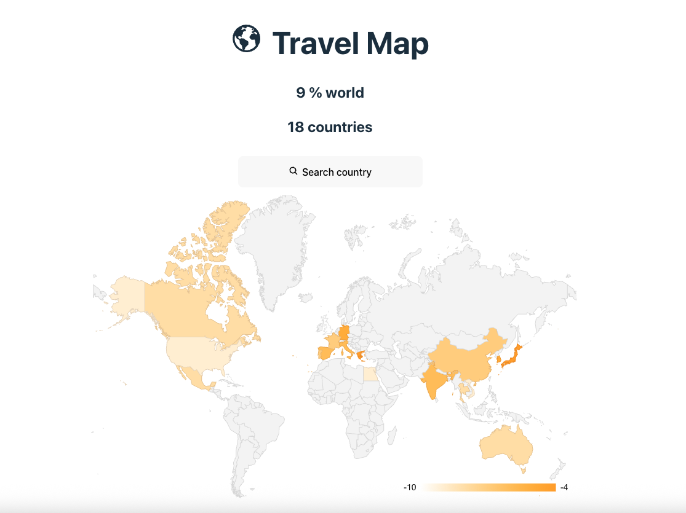

# Travel Map

### 地図に旅行を記録できるアプリ

スタンプラリー感覚で、旅行した国を世界地図上に色塗りして楽しむことができます。

地図に紐づいて、訪れた日とコメント・写真数枚を気軽に追加できます。
シンプルな機能のみなので、直感で操作ができます。



## 使用技術

- javascript
- react 19.2.0
- node.js
- express
- postgreSQL

## 主な機能

- 旅行した国の世界地図表示（トップページ）
- 旅行の記録を追加・編集（日付・コメント・写真）

## セットアップ手順

データベースの構築

```sh
psql
CREATE DATABASE visits;
\q
```

.env ファイルの作成（

```sh
cp .env.sample .env
```

.env ファイルに必要な環境変数を設定

```sh
DB_USER=
DB_PASSWORD=
DB_NAME=visits
NODE_ENV=development
```

依存関係のインストール/ビルド/マイグレーション/シード

```sh
npm run build
```

データベースの確認

```sh
psql -d visits
\dt
SELECT * FROM countries;
\q
```

## 構成


### データベース（例）

| id  | country_name             | is_visited | visit_date | memo           | picture        |
| --- | ------------------------ | ---------- | ---------- | -------------- | -------------- |
| 1   | United States of America | True       | 2018.2.10  | 楽しかった！   | http://www.... |
| 2   | United Arab Emirates     | True       | 2019.12.26 | 異世界すぎる！ | http://www.... |
| 3   | Belgium                  | False      |            |                |                |
| 4   | Finland                  | False      |            |                |                |
| 5   | Hong Kong                | True       | 2024.8.13  |                | http://www.... |

## リソース

- [React Google Charts](https://www.react-google-charts.com/)
- [react-icons](https://react-icons.github.io/react-icons/)

## 将来の計画

- ログイン機能
- 他のユーザーとのマップ共有、旅行データ共有機能
- コメント・いいね機能
- 国・写真選択などの UI 改善
